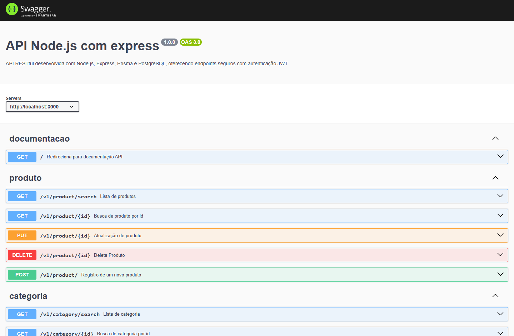

# 🧩 Projeto Backend - API REST com Node.js, Express e PostgreSQL

Este projeto é o trabalho final da parte de backend do curso de Fullstack da Digital College. Desenvolvemos uma API RESTful para gerenciamento de usuários, categorias e produtos, utilizando autenticação JWT e banco de dados relacional com PostgreSQL via Prisma ORM.

---

## 🚀 Link do Projeto

A API está hospedada em:  
🔗 [https://project-backend-gt.onrender.com](https://project-backend-gt.onrender.com)

A documentação Swagger está disponível diretamente ao acessar esse link pelo navegador.



---

## 🧑‍💻 Equipe de Desenvolvimento

- Leonardo  
- Thais  
- Enyd  
- Luanny

---

## 📁 Estrutura de Diretórios


```
📦 src
├── 📂 __tests__         # Testes automatizados com JEST
├── 📂 config            # Configurações gerais do projeto
├── 📂 controllers       # Lógica das rotas (camada de controle)
├── 📂 middleware        # Middlewares como autenticação JWT
├── 📂 repositories      # Comunicação com o banco de dados via Prisma
├── 📂 routes            # Definição das rotas da API
├── 📂 services          # Lógica de negócio (camada de serviço)
├── app.js              # Instancia o app Express
└── server.js           # Inicializa o servidor
```

---

## 🛠️ Tecnologias Utilizadas

- **Node.js** – Executar JavaScript no backend  
- **Express.js** – Framework para rotas e middleware  
- **Dotenv** – Variáveis de ambiente seguras  
- **Nodemon** – Atualização automática no desenvolvimento  
- **PostgreSQL** – Banco de dados relacional  
- **Prisma ORM** – Mapeamento objeto-relacional  
- **JWT** – Autenticação via tokens  
- **JEST** – Testes automatizados

---

## ✅ Códigos de Status (HTTP)

- `200 OK` – Requisição realizada com sucesso (resposta com conteúdo)  
- `201 CREATED` – Recurso criado com sucesso  
- `204 No Content` – Sucesso, mas sem corpo de resposta (ex: DELETE)  
- `400 Bad Request` – Erro na requisição do cliente  
- `401 Unauthorized` – Falta de autenticação válida  
- `404 Not Found` – Recurso não encontrado

---

## 📚 Escopo e Funcionalidades

### 🔖 Seção 01 – Banco de Dados

- [x] Criar tabela de **usuários**  
- [x] Criar tabela de **categorias**  
- [x] Criar tabela de **produtos**  
- [x] Criar tabela de **imagens de produtos**  
- [x] Criar tabela de **opções de produtos**  
- [x] Criar tabela relacional entre **produtos e categorias**

---

### 👥 Seção 02 – CRUD de Usuários

- [x] GET - Obter usuário por ID  
- [x] POST - Cadastrar usuário  
- [x] PUT - Atualizar usuário  
- [x] DELETE - Deletar usuário  

---

### 🏷️ Seção 03 – CRUD de Categorias

- [x] GET - Listar todas as categorias  
- [x] GET - Obter categoria por ID  
- [x] POST - Cadastrar nova categoria  
- [x] PUT - Atualizar categoria existente  
- [x] DELETE - Remover categoria  

---

### 📦 Seção 04 – CRUD de Produtos

- [x] GET - Listar todos os produtos  
- [x] GET - Obter produto por ID  
- [x] POST - Criar novo produto  
- [x] PUT - Atualizar produto existente  
- [x] DELETE - Remover produto  

---

### 🔐 Seção 05 – Autenticação JWT

- [x] POST - Gerar token JWT (login)  
- [x] Validar token nas rotas `POST`, `PUT` e `DELETE`

---

## ▶️ Como Rodar Localmente

1. Clone o repositório:
   ```bash
   git clone https://github.com/seu-usuario/nome-do-repositorio.git
   ```

2. Instale as dependências:
   ```bash
   npm install
   ```

3. Configure o arquivo `.env` com as variáveis de ambiente.

4. Rode a aplicação:
   ```bash
   npm run dev
   ```

5. Acesse: `http://localhost:3000`

---

## 🧪 Testes

Todos os testes foram implementados utilizando a biblioteca **Jest**, garantindo a integridade e estabilidade das rotas e regras de negócio.

---

## 📜 Licença

Este projeto é de uso educacional, desenvolvido para fins de aprendizado.